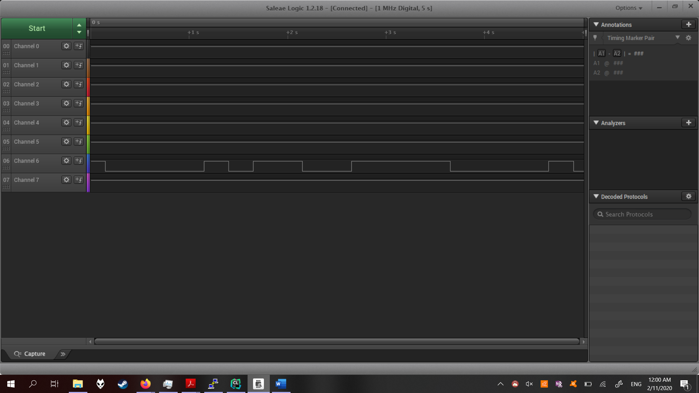
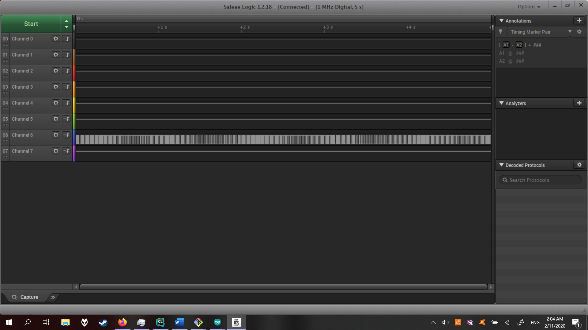
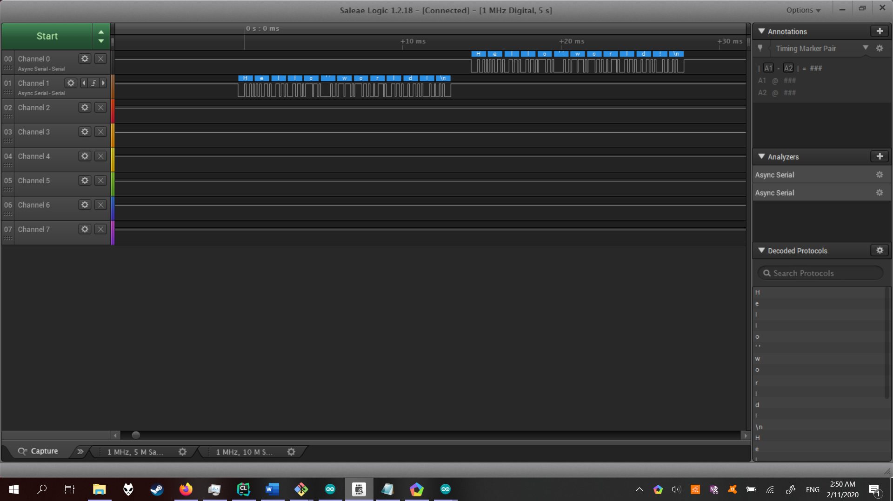
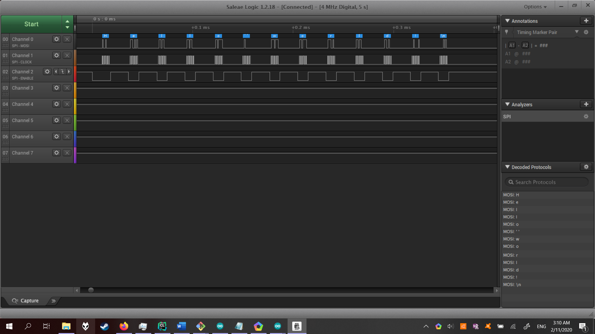

Name: Kerry Tu

EID: kt25566

Team Number:

## Questions

1. Why does your program need a setup and a loop?

    The setup is used to prepare all initial setup required such as initializing variables, while the loop is used to repeat instructions while the controller is running.

2. What is the downside to putting all your code in a loop?

    The code will be too messy, so it may cause difficulties in reading code when debuggging.

3. Why does your code need to be compiled?

    The program needs to be converted into a format that the computer understands and can run.

4. When lowering the frequency in procedure A, step 4, what is going wrong? Brainstorm some solutions. Dimmers exist in the real world. What is their solution?

    The LED is flickering noticeably. A solution is increasing the frequency so that the flickering is not noticeable. Dimmer change the voltage waveform so that the light intensity changes.

5. Why do you need to connect the logic analyzer ground to the ESP32 ground?

    The logic analyzer needs a ground in order to have a reference to analyze voltage differences, and to close the circuit.

6. What is the difference between synchronous and asynchronous communication?

    Synchronous is the exchange of information in real-time, while asynchronous does not require interaction in real-time.

7. Profile of UART: Sent X bytes in Y time 

    13 bytes in 28.185 ms

8. Profile of SPI: Sent X bytes in Y time

    13 bytes in 0.3555 ms

9. Why is SPI so much faster than UART?

    SPI is synchronous while UART is asynchronous, and SPI has more wires to help transmit.

10. list one pro and one con of UART

    UART requires fewer wires, but it is slower than SPI.

11. list one pro and one con of SPI

    SPI is faster, but it requires more wires than UART.

12. list one pro and one con of I2C

    I2C only requires 2 pins, but the lines are open drain, so pull up or pull down resistor are needed.

13. Why does I2C need external resistors to work?

    I2C needs external resistors because the lines are open drain.

## Screenshots

Procedure A, step 1:

Procedure A, step 4:

Procedure B, UART:

Procedure B, SPI:

